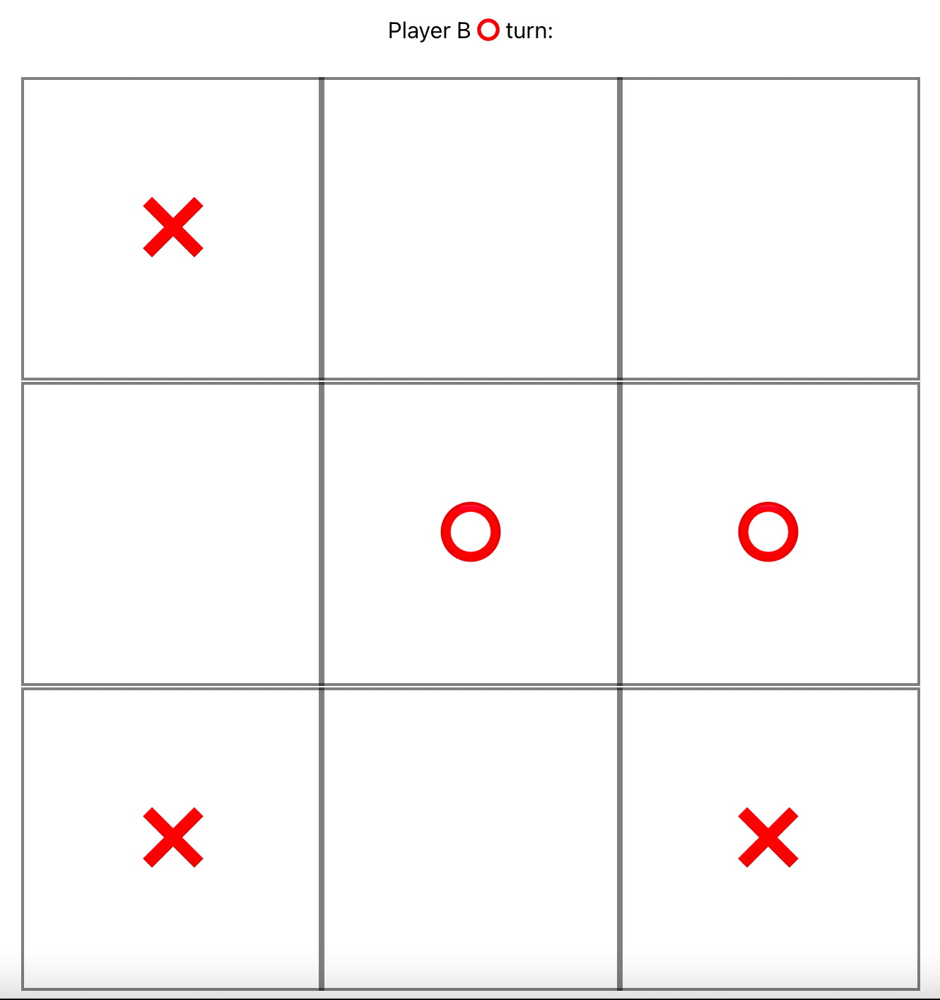

# Tic Tac Toe in React


This project is a responsive HTML5 Tic tac Toe Game built with
[Create React App 5](https://github.com/facebook/create-react-app) with the Typescript template.



## Installing

Clone the repo and install the dependencies with `yarn`,
then run the application using:

```shell
$ yarn start
```

To build and run tests, see the Available Scripts section
below

## Available Scripts

In the project directory, you can run:

### `yarn start`

Runs the app in the development mode.\
Open [http://localhost:3000](http://localhost:3000) to view it in the browser.

The page will reload if you make edits.\
You will also see any lint errors in the console.

### `yarn test`

Launches the test runner in the interactive watch mode.

### `yarn test:coverage`

Launches the test runner to generate coverage report.

### `yarn build`

Builds the app for production to the `build` folder.\
It correctly bundles React in production mode and optimizes the build for the best performance.

The build is minified and the filenames include the hashes.\
Your app is ready to be deployed!

See the section about [deployment](https://facebook.github.io/create-react-app/docs/deployment) for more information.

## Learn More

You can learn more in the [Create React App documentation](https://facebook.github.io/create-react-app/docs/getting-started).

To learn React, check out the [React documentation](https://reactjs.org/).
